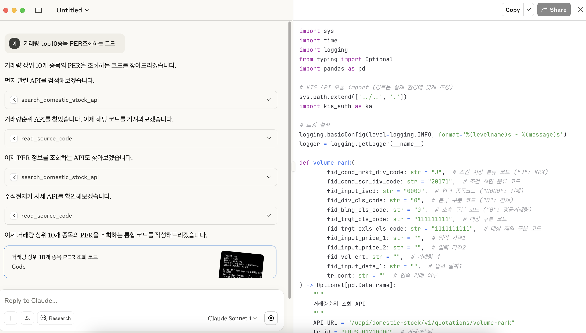
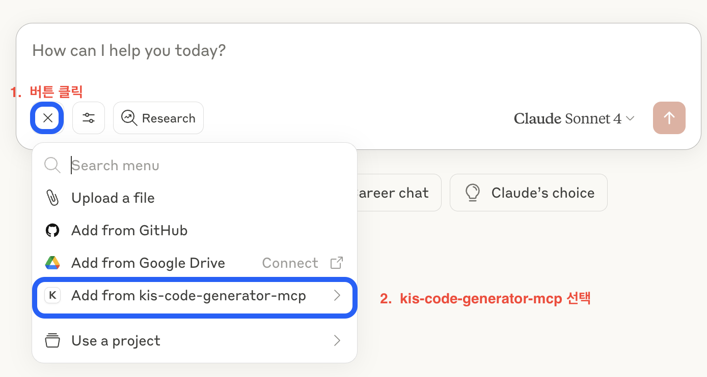
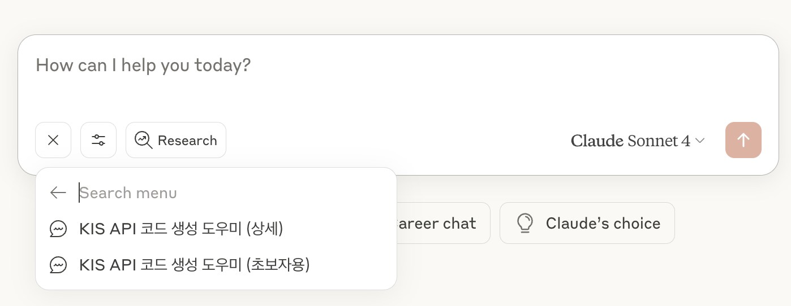
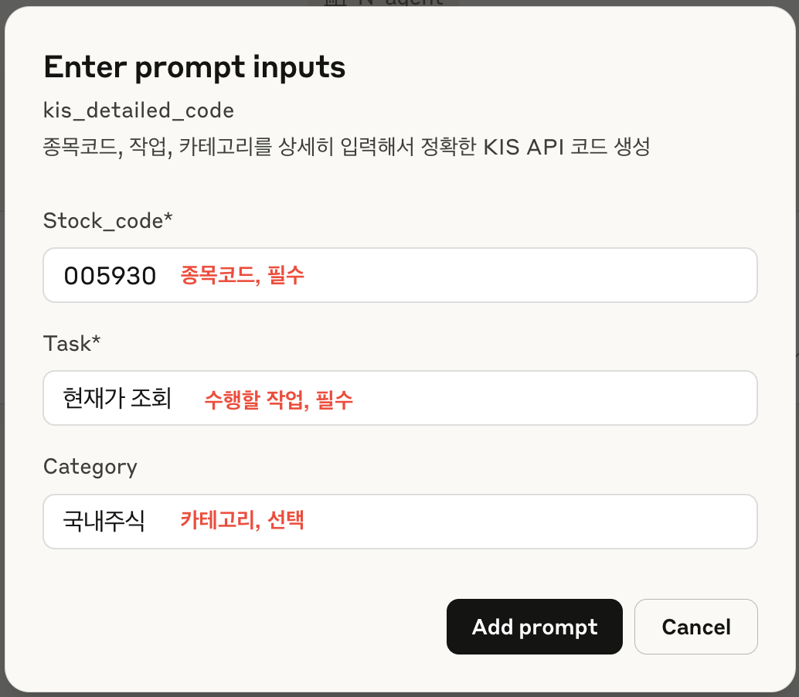
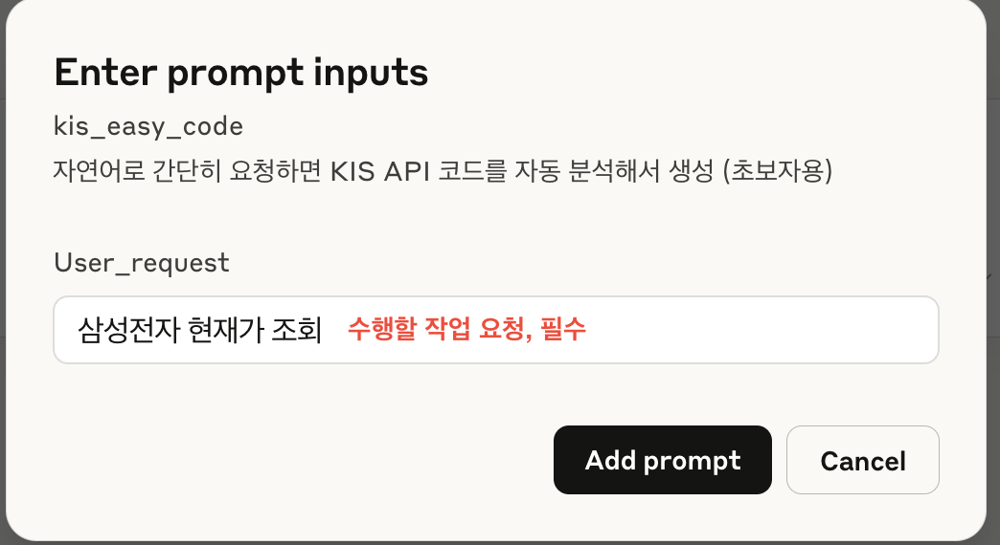
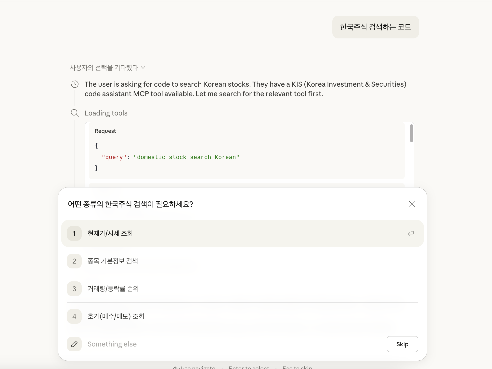
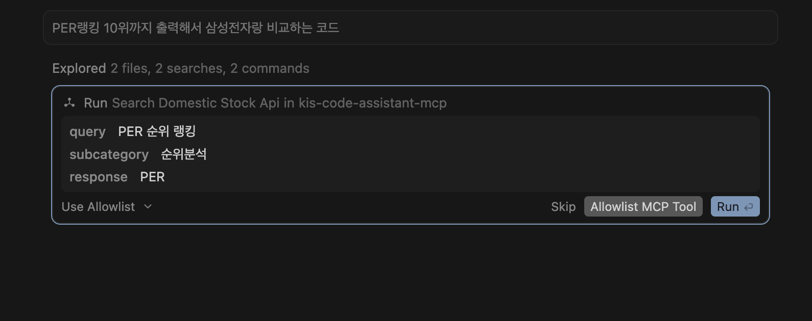

# 한국투자증권 코딩 도우미 MCP (KIS Code Assistant MCP)

한국투자증권의 다양한 Open API를 자연어로 쉽게 검색하고, 샘플코드까지 자동 구성해주는 MCP 서버입니다.



## 🚀 주요 기능

### 지원하는 API 카테고리

| 카테고리 | 개수 | 주요 기능 |
|---------|------|----------|
| 인증 | 2개 | 접근토큰발급, 웹소켓 접속키 발급 |
| 국내주식 | 156개 | 현재가, 호가, 차트, 잔고, 주문, 순위분석, 시세분석, 종목정보, 실시간시세 등 |
| 해외주식 | 50개 | 미국/아시아 주식 시세, 잔고, 주문, 체결내역, 거래량순위, 권리종합 등 |
| 국내선물옵션 | 43개 | 선물옵션 시세, 호가, 차트, 잔고, 주문, 야간거래, 실시간체결 등 |
| 해외선물옵션 | 35개 | 해외선물 시세, 주문내역, 증거금, 체결추이, 옵션호가 등 |
| ELW | 24개 | ELW 시세, 거래량순위, 민감도순위, 변동성추이, 지표순위 등 |
| 국내채권 | 18개 | 채권 시세, 호가, 발행정보, 잔고조회, 주문체결내역 등 |
| ETF/ETN | 6개 | NAV 비교추이, 현재가, 구성종목시세 등 |

**전체 API 총합계: 334개**

### 핵심 특징
- 🔍 **스마트 검색**: 자연어로 원하는 API 기능 검색
- 📝 **샘플코드 제공**: GitHub에서 실제 구현 코드 자동 검색
- 📂 **카테고리별 탐색**: 기능별 체계적인 API 분류
- 💬 **프롬프트 기능**: 종목코드와 작업만 입력하면 완전한 코드 생성
- 🖥️ **크로스 플랫폼**: Windows, macOS, Linux 모두 지원

## 📦 설치 및 설정

### 📋 요구사항
- Python 3.12 이상
- [uv](https://docs.astral.sh/uv/) 패키지 매니저
- Docker (HTTP 서버 방식 사용 시)

### 📋 설치 단계

#### **1단계: 프로젝트 클론**
```bash
git clone https://github.com/koreainvestment/open-trading-api.git
cd "open-trading-api/MCP/KIS Code Assistant MCP"
```

#### **2단계: 패키지 설치**
```bash
uv sync
```

#### **3단계: 서버 실행**

**방법 1: 로컬 실행 (stdio)**
```bash
uv run server.py --stdio
```

**방법 2: HTTP 서버 실행**
```bash
uv run server.py
```

**방법 3: Docker (권장)**
```bash
# Docker 이미지 빌드
docker build -t kis-code-assistant-mcp .

# 서버 실행
docker run -d -p 8081:8081 --name kis-code-assistant-mcp kis-code-assistant-mcp
```

#### **4단계: 서버 상태 확인 (HTTP 방식)**
```bash
curl http://localhost:8081/health
# {"status":"healthy","server":"kis-code-assistant-mcp","version":"0.1.0",...}
```

## 🔗 AI 도구 연동 설정

### 📝 Claude Desktop

Claude Desktop 설정 파일(`claude_desktop_config.json`)에 아래 내용을 추가합니다.

**설정 파일 위치:**
- **macOS**: `~/Library/Application Support/Claude/claude_desktop_config.json`
- **Windows**: `%APPDATA%\Claude\claude_desktop_config.json`

```json
{
  "mcpServers": {
    "kis-code-assistant-mcp": {
      "command": "{uv 실행 경로}",
      "args": [
        "--directory", "{프로젝트 폴더 경로}/MCP/KIS Code Assistant MCP",
        "run", "server.py", "--stdio"
      ]
    }
  }
}
```

- `{uv 실행 경로}`: 터미널에서 `which uv` (macOS/Linux) 또는 `where uv` (Windows) 명령으로 확인한 전체 경로 (예: `/Users/username/.local/bin/uv`)
- `{프로젝트 폴더 경로}`: 저장소를 클론한 절대 경로 (예: `/Users/username/open-trading-api`)

Claude Desktop을 재시작하면 홈 화면 대화창 하단 **검색 및 도구** 버튼에서 연결을 확인할 수 있습니다.

### 📝 Cursor

Docker 컨테이너 또는 로컬 HTTP 서버를 실행한 뒤, Cursor의 `Settings > MCP Servers`에서 아래 설정을 추가합니다.

```json
{
  "mcpServers": {
    "kis-code-assistant-mcp": {
      "url": "http://localhost:8081/mcp"
    }
  }
}
```

> Cursor는 stdio 방식도 지원합니다. Claude Desktop과 동일한 설정을 사용할 수 있습니다.

## 💬 사용법 및 질문 예시

### 프롬프트 기능

자연어 요청만으로 정확한 코드를 생성할 수 있는 프롬프트 기능을 제공합니다.




#### `kis_detailed_code` - 자세한 입력
```
stock_code: "005930"     # 종목코드 (필수)
task: "주식 현재가 조회"  # 작업 내용 (필수)
category: "국내주식"      # 카테고리 선택
```

→ **종목 코드 및 수행하고 싶은 작업을 알고 있을 때, 보다 정확한 코드 생성**

#### `kis_easy_code` - 자연어 입력
```
user_request: "삼성전자 주가 확인하고 싶어"  # 자연어 요청 (필수)
```

→ **어떤 API를 써야 할지 모를 때, 자동 분석 후 코드 생성**

### 검색 질문 예시

- "삼성전자 현재가 API 찾아줘"
- "내 해외주식 잔고 조회하는 방법"
- "채권 호가 정보 가져오는 API"
- "오늘 뉴스 제목 조회 API"
- "ELW 거래량 순위 보여줘"
- "코스피200 선물 실시간 시세 받는 방법"

### 응답 형태

```json
{
  "status": "success",
  "total_count": 1,
  "results": [
    {
      "function_name": "inquire_price",
      "api_name": "주식현재가 시세",
      "category": "domestic_stock",
      "subcategory": "기본시세"
    }
  ]
}
```

## 📁 파일 구조

```
KIS Code Assistant MCP/
├── server.py              # MCP 서버 메인 파일
├── data.csv               # API 정보 데이터
├── pyproject.toml         # 프로젝트 설정 및 의존성
├── uv.lock                # 의존성 잠금 파일
├── Dockerfile             # Docker 이미지 빌드 파일
├── README.md              # 프로젝트 설명서
├── .gitignore             # Git 무시 파일 목록
├── .dockerignore          # Docker 무시 파일 목록
├── .python-version        # Python 버전 지정
├── images/                # 프로젝트 이미지 파일들
└── src/
    ├── prompts/
    │   └── prompt.py      # 프롬프트 관련 코드
    └── utils/
        └── api_searcher.py # API 검색 로직
```

## 🛠️ 문제 해결

### 일반적인 문제들

**1. Claude Desktop에서 서버가 연결되지 않는 경우**
```bash
# uv 경로 확인
which uv    # macOS/Linux
where uv    # Windows
```
- `command`에 `uv` 전체 경로를 입력했는지 확인
- `--directory` 경로가 절대 경로인지 확인
- Claude Desktop을 완전히 종료 후 재시작

**2. Cursor에서 ECONNREFUSED 오류**
```bash
# 서버가 실행 중인지 확인
curl http://localhost:8081/health

# Docker 컨테이너 확인
docker ps --filter "name=kis-code-assistant-mcp"
```
- HTTP 서버 또는 Docker 컨테이너가 실행 중이어야 합니다

**3. Docker 컨테이너가 시작되지 않는 경우**
```bash
# 로그 확인
docker logs kis-code-assistant-mcp

# 컨테이너 재시작
docker restart kis-code-assistant-mcp
```

**4. 검색 결과가 없는 경우**
- 다른 검색 키워드로 재시도
- `function_name` → `api_name` → `subcategory` 순으로 검색 범위를 넓혀보세요
- 최대 10개 결과만 반환됩니다 (`total_count`로 전체 개수 확인 가능)

## ⚠️ 제한사항

- 미리 지정한 API 명세(data.csv)에 의존합니다
- 검색 정확도는 질문 방식에 따라 달라질 수 있습니다
- 실제 API 호출은 별도로 구현이 필요합니다 (KIS Trading MCP 참고)

## 🔗 관련 링크

- [한국투자증권 개발자 센터](https://apiportal.koreainvestment.com/)
- [한국투자증권 OPEN API GitHub](https://github.com/koreainvestment/open-trading-api)
- [MCP (Model Context Protocol) 공식 문서](https://modelcontextprotocol.io/)
- [MCP AI 도구 연결 방법](../MCP%20AI%20도구%20연결%20방법.md)

## 📌 참고

260318 동작 확인



