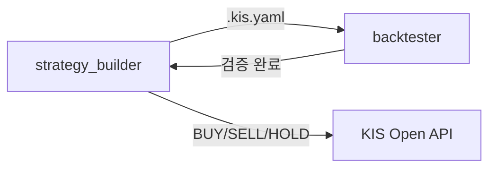

**[당사에서 제공하는 샘플코드에 대한 유의사항]**

- 샘플 코드는 한국투자증권 Open API(KIS Developers)를 연동하는 예시입니다. 고객님의 개발 부담을 줄이고자 참고용으로 제공되고 있습니다.
- 샘플 코드는 별도의 공지 없이 지속적으로 업데이트될 수 있습니다.
- 샘플 코드를 활용하여 제작한 고객님의 프로그램으로 인한 손해에 대해서는 당사에서 책임지지 않습니다.

# KIS Open API 샘플 코드 저장소 (LLM 지원)

## 1. 제작 의도 및 대상

### 🎯 제작 의도

이 저장소는 **ChatGPT, Claude 등 LLM(Large Language Model)** 기반 자동화 환경과 Python 개발자 모두가
**한국투자증권(Korea Investment & Securities) Open API를 쉽게 이해하고 활용**할 수 있도록 구성된 샘플 코드 모음입니다.

- `examples_llm/`: LLM이 단일 API 기능을 쉽게 탐색하고 호출할 수 있도록 구성된 기능 단위 샘플 코드
- `examples_user/`: 사용자가 실제 투자 및 자동매매 구현에 활용할 수 있도록 상품별로 통합된 API 호출 예제 코드
- `strategy_builder/`: 비주얼 UI로 매매 전략을 설계하고, 생성된 시그널 바탕으로 매수/매도 가능
- `backtester/`: 설계한 전략을 과거 데이터로 검증하는 백테스팅 엔진

> AI와 사람이 모두 활용하기 쉬운 구조를 지향합니다.

[한국투자증권 Open API 포털 바로가기](https://apiportal.koreainvestment.com/)

### 👤 대상 사용자

- 한국투자증권 Open API를 처음 사용하는 Python 개발자
- 기존 Open API 사용자 중 코드 개선 및 구조 학습이 필요한 사용자
- LLM 기반 코드 에이전트를 활용해 종목 검색, 시세 분석, 자동매매 등을 구현하고자 하는 사용자

## 2. 폴더 구조 및 주요 파일 설명

### 2.1. 폴더 구조

```
# 프로젝트 구조
.
├── README.md                    # 프로젝트 설명서
├── strategy_builder/            # 전략 설계 + 시그널 생성 엔진           ← New
├── backtester/                  # 백테스팅 엔진 (QuantConnect Lean)   ← New
│
├── docs/
│   └── convention.md            # 코딩 컨벤션 가이드
├── examples_llm/                  # LLM용 샘플 코드
│   ├── kis_auth.py              # 인증 공통 함수
│   ├── auth                     # 인증(토큰 발급)
│   │   ├── auth_token               # REST 접근토큰 발급
│   │   └── auth_ws_token            # 웹소켓 접속키 발급
│   ├── domestic_bond            # 국내채권
│   │   └── inquire_price        # API 단일 기능별 폴더
│   │       ├── inquire_price.py         # 한줄 호출 파일 (예: 채권 가격 조회)
│   │       └── chk_inquire_price.py     # 테스트 파일 (예: 채권 가격 조회 결과 검증)
│   ├── domestic_futureoption    # 국내선물옵션
│   ├── domestic_stock           # 국내주식
│   ├── elw                      # ELW
│   ├── etfetn                   # ETF/ETN
│   ├── overseas_futureoption    # 해외선물옵션
│   └── overseas_stock           # 해외주식
├── examples_user/                 # user용 실제 사용 예제
│   ├── kis_auth.py              # 인증 공통 함수
│   ├── auth                     # 인증(토큰 발급)
│   │   ├── auth_functions.py            # 인증 함수 모음
│   │   └── auth_examples.py             # 인증 실행 예제
│   ├── domestic_bond            # 국내채권
│   │   ├── domestic_bond_functions.py        # (REST) 통합 함수 파일 (모든 API 함수 모음)
│   │   ├── domestic_bond_examples.py         # (REST) 실행 예제 파일 (함수 사용법)
│   │   ├── domestic_bond_functions_ws.py     # (Websocket) 통합 함수 파일
│   │   └── domestic_bond_examples_ws.py      # (Websocket) 실행 예제 파일
│   ├── domestic_futureoption    # 국내선물옵션
│   ├── domestic_stock           # 국내주식
│   ├── elw                      # ELW
│   ├── etfetn                   # ETF/ETN
│   ├── overseas_futureoption    # 해외선물옵션
│   └── overseas_stock           # 해외주식
├── legacy/                      # 구 샘플코드 보관
├── stocks_info/                 # 종목정보파일 참고 데이터
├── kis_devlp.yaml               # API 설정 파일 (개인정보 입력 필요)
├── pyproject.toml               # (uv)프로젝트 의존성 관리
└── uv.lock                      # (uv)의존성 락 파일
```

### 2.2. 지원되는 주요 API 카테고리

- 아래 카테고리 및 폴더 구조는 examples_llm/, examples_user/ 폴더 모두 동일하게 적용됩니다.

| 카테고리 | 설명 | 폴더명 |
| --- | --- | --- |
| 인증 | 접근토큰 발급, 웹소켓 접속키 발급 | `auth` |
| 국내주식 | 국내 주식 시세, 주문, 잔고 등 | `domestic_stock` |
| 국내채권 | 국내 채권 시세, 주문 등 | `domestic_bond` |
| 국내선물옵션 | 국내 파생상품 관련 | `domestic_futureoption` |
| 해외주식 | 해외 주식 시세, 주문 등 | `overseas_stock` |
| 해외선물옵션 | 해외 파생상품 관련 | `overseas_futureoption` |
| ELW | ELW 시세 API | `elw` |
| ETF/ETN | ETF, ETN 시세 API | `etfetn` |

### 2.3. 주요 파일 설명

### `examples_llm/` - llm용 기능 단위 샘플 코드

**API별 개별 폴더 구조**: 단일 API 기능을 독립 폴더로 분리하여, LLM이 관련 코드를 쉽게 탐색할 수 있도록 구성
- **한줄 호출 파일**: `[함수명].py` – 단일 기능을 호출하는 최소 단위 코드 (예: `inquire_price.py`)
- **테스트 파일**: `chk_[함수명].py` – 호출 결과를 검증하는 테스트 실행 코드 (예: `chk_inquire_price.py`)

### `examples_user/` - 사용자용 통합 예제 코드

**카테고리별 개별 폴더 구조**: 카테고리(상품)별로 모든 기능을 통합하여, 사용자가 쉽게 샘플 코드를 탐색하고 실행할 수 있도록 구성
- **통합 함수 파일**: `[카테고리]_functions.py` - 해당 카테고리의 모든 API 기능이 통합된 함수 모음
- **실행 예제 파일**: `[카테고리]_examples.py` - 실제 사용 예제를 기반으로 한 실행 코드
- **웹소켓 통합 함수 파일 및 실행 예제 파일**: `[카테고리]_functions_ws.py`, `[카테고리]_examples_ws.py`

### `kis_auth.py` - 인증 및 공통 기능

- 접근토큰 발급 및 관리
- API 호출 공통 함수
- 실전투자/모의투자 환경 전환 지원
- 웹소켓 연결 설정 기능 제공

### 2.4. AI 트레이딩 도구

샘플 코드 외에, Open API를 활용한 **전략 설계 → 백테스팅 → 주문 실행** 파이프라인을 제공합니다.



| 디렉토리 | 역할 | 상세 |
|----------|------|------|
| `strategy_builder/` | 전략 설계 + 시그널 생성 | 80개 기술지표, 10개 프리셋 전략, BUY/SELL/HOLD 신호 ([README](strategy_builder/README.md)) |
| `backtester/` | 과거 검증 + 파라미터 최적화 | Docker 기반 QuantConnect Lean, HTML 리포트 ([README](backtester/README.md)) |
| `MCP/` | AI 도구 연결 | KIS Code Assistant + Trading MCP ([README](MCP/README.MD)) |

#### 10개 프리셋 전략

`strategy_builder`와 `backtester` 양쪽에서 동일하게 지원합니다.

| # | 전략명 | 유형 | 한줄 설명 |
|---|--------|------|-----------|
| 01 | 골든크로스 | 추세추종 | 단기 이동평균이 장기 이동평균을 상향 돌파하면 매수 |
| 02 | 모멘텀 | 추세추종 | 최근 N일 수익률이 높은 종목을 매수 |
| 03 | 52주 신고가 | 돌파매매 | 종가가 52주 최고가를 갱신하면 매수 |
| 04 | 연속 상승/하락 | 추세추종 | N일 연속 종가 상승 시 매수, N일 연속 하락 시 매도 |
| 05 | 이격도 | 역추세 | 종가/이동평균 비율로 과열(매도)·침체(매수) 판단 |
| 06 | 돌파 실패 | 손절 | 전고점 돌파 후 다시 아래로 빠지면 손절 |
| 07 | 강한 종가 | 모멘텀 | 종가가 당일 고가 근처에서 마감하면 매수 |
| 08 | 변동성 확장 | 돌파매매 | 변동성이 줄어든 뒤 급등하면 매수 |
| 09 | 평균회귀 | 역추세 | 가격이 평균에서 크게 벗어나면 반대 방향으로 매매 |
| 10 | 추세 필터 | 추세추종 | 장기 이동평균 위에서 상승 중이면 매수 |

#### .kis.yaml — 공유 전략 포맷

`strategy_builder`에서 설계한 전략을 `.kis.yaml`로 내보내면, `backtester`에서 그대로 Import하여 백테스트를 수행할 수 있습니다.
포맷 상세는 [strategy_builder/README.md](strategy_builder/README.md#kisyaml-포맷) 또는 [backtester/README.md](backtester/README.md#kisyaml-포맷)를 참고하세요.

## 3. 사전 환경설정 안내

### 3.1. Python 환경 요구사항

- **Python 3.11 이상** 필요
- **uv** **패키지 매니저 사용** 권장 (빠르고 간편한 의존성 관리)

### 3.2. uv 설치 방법

- 간편 설정을 위해 uv를 권장합니다

```bash
# Windows (PowerShell)
powershell -c "irm https://astral.sh/uv/install.ps1 | iex"

# macOS/Linux
curl -LsSf https://astral.sh/uv/install.sh | sh

# 설치 확인
uv --version
# uv 0.x.x ... -> 설치 완료
```

### 3.3. 프로젝트 클론 및 환경 설정

```bash
# 저장소 클론
git clone https://github.com/koreainvestment/open-trading-api
cd open-trading-api

# uv를 사용한 의존성 설치 - 한줄로 끝
uv sync
```

### 3.4. KIS Open API 신청 및 설정

🍀 [서비스 신청 안내 바로가기](https://apiportal.koreainvestment.com/about-howto)
1. 한국투자증권 **계좌 개설 및 ID 연결**
2. 한국투자증권 홈페이지 or 앱에서 **Open API 서비스 신청**
3. **앱키(App Key)**, **앱시크릿(App Secret)** 발급
4. **모의투자** 및 **실전투자** 앱키 각각 준비

### 3.5. kis_devlp.yaml 설정

- 본인의 계정 설정을 위해 `kis_devlp.yaml` 파일을 수정합니다.
- 기본 경로는 `~/KIS/config/kis_devlp.yaml`입니다. 폴더가 없으면 생성해 주세요.
- 프로젝트 루트의 `kis_devlp.yaml`을 `~/KIS/config/`로 복사한 뒤 수정하는 것을 권장합니다.
- 경로를 변경하고 싶다면 `kis_auth.py`의 `config_root` 값을 수정하면 됩니다.

```bash
# 설정 폴더 생성 및 파일 복사
mkdir -p ~/KIS/config
cp kis_devlp.yaml ~/KIS/config/
```

1. `~/KIS/config/kis_devlp.yaml` 파일 열기
2. **앱키와 앱시크릿** 정보 입력
3. **HTS ID** 정보 입력
4. **계좌번호** 정보 입력 (앞 8자리와 뒤 2자리 구분)
5. **저장** 후 닫기

```yaml
# 실전투자
my_app: "여기에 실전투자 앱키 입력"
my_sec: "여기에 실전투자 앱시크릿 입력"

# 모의투자
paper_app: "여기에 모의투자 앱키 입력"
paper_sec: "여기에 모의투자 앱시크릿 입력"

# HTS ID(KIS Developers 고객 ID) - 체결통보, 나의 조건 목록 확인 등에 사용됩니다.
my_htsid: "사용자 HTS ID"

# 계좌번호 앞 8자리
my_acct_stock: "증권계좌 8자리"
my_acct_future: "선물옵션계좌 8자리"
my_paper_stock: "모의투자 증권계좌 8자리"
my_paper_future: "모의투자 선물옵션계좌 8자리"

# 계좌번호 뒤 2자리
my_prod: "01" # 종합계좌
# my_prod: "03" # 국내선물옵션 계좌
# my_prod: "08" # 해외선물옵션 계좌
# my_prod: "22" # 개인연금 계좌
# my_prod: "29" # 퇴직연금 계좌

# User-Agent(기본값 사용 권장, 변경 불필요)
my_agent: "Mozilla/5.0 (Windows NT 10.0; Win64; x64) AppleWebKit/537.36"
```

### 3.6. 실행파일 내 인증 설정 검토

- 실행하려는 파일에서 인증 관련 설정을 검토 혹은 변경해줍니다. 국내주식 기능 전체를 이용하시려면, `domestic_stock/domestic_stock_examples.py` 파일을 확인해주세요. 
ka.auth() 함수의 svr, product 매개변수를 아래와 같이 수정하면 실전환경(prod)에서 위탁계좌(-01)로 매매 테스트가 가능합니다.

```python
import kis_auth as ka

# 실전투자 인증
ka.auth(svr="prod", product="01") # 모의투자: svr="vps"
```

### 3.7. 전략 빌더 / 백테스터 환경 설정 (선택)

전략 설계 및 백테스팅 기능을 사용하려면 추가 설정이 필요합니다.

| 항목 | 설치 | 용도 |
|------|------|------|
| Node.js 18+ | [nodejs.org](https://nodejs.org/) | strategy_builder, backtester 프론트엔드 |
| Docker Desktop | [docker.com](https://www.docker.com/products/docker-desktop) | backtester (Lean 엔진) |

## 4. 샘플 코드 실행

### 4.1. 샘플 코드 실행

- **examples_user 기준**

```bash
# 국내주식 샘플 코드 실행 (examples_user/domestic_stock/)
uv run python domestic_stock_examples.py # REST 방식
uv run python domestic_stock_examples_ws.py  # Websocket 방식 
```

domestic_stock_examples.py에는 여러 함수가 포함되어 있으므로, 사용하려는 함수만 남기고 나머지는 주석 처리한 후, 입력값을 수정하여 호출해 주세요.

- **examples_llm 기준**

```bash
# 국내주식 > 주식현재가 시세 샘플 코드 실행 (examples_llm/domestic_stock/inquire_price/)
uv run python chk_inquire_price.py
```

examples_llm 은 각 기능별로 개별 실행 파일(chk_*.py)이 분리되어 있어, 특정 기능만 테스트하고자 할 때 유용합니다.

### 4.2. 예제 코드 샘플 (examples_user)

```python
# REST API 호출 예제 - domestic_stock_examples.py
import sys
import logging
import pandas as pd
sys.path.extend(['..', '.'])

import kis_auth as ka
from domestic_stock_functions import *

# 로깅 설정
logging.basicConfig(level=logging.INFO, format='%(levelname)s - %(message)s')
logger = logging.getLogger(__name__)

# 인증
ka.auth()
trenv = ka.getTREnv()

# 삼성전자 현재가 시세 조회
result = inquire_price(env_dv="real", fid_cond_mrkt_div_code="J", fid_input_iscd="005930")
print(result)
```

```python
# 웹소켓 호출 예제 - domestic_stock_examples_ws.py
import sys
import logging
import pandas as pd
sys.path.extend(['..', '.'])

import kis_auth as ka
from domestic_stock_functions_ws import *

# 로깅 설정
logging.basicConfig(level=logging.INFO, format='%(levelname)s - %(message)s')
logger = logging.getLogger(__name__)

# 인증
ka.auth()
ka.auth_ws()
trenv = ka.getTREnv()

# 웹소켓 선언
kws = ka.KISWebSocket(api_url="/tryitout")

# 삼성전자, sk하이닉스 실시간 호가 구독
kws.subscribe(request=asking_price_krx, data=["005930", "000660"])
```

### 4.3. 전략 빌더 / 백테스터 실행

```bash
# Strategy Builder (전략 설계 + 시그널)
cd strategy_builder
./start.sh

# Backtester (백테스팅)
cd backtester
./start.sh
```

상세 실행 방법은 각 디렉토리의 README를 참고하세요:
- [strategy_builder/README.md](strategy_builder/README.md)
- [backtester/README.md](backtester/README.md)

## 5. 문제 해결 가이드

### 토큰 오류 시

```python
import kis_auth as ka

# 토큰 재발급 - 1분당 1회 발급됩니다.
ka.auth(svr="prod")  # 또는 "vps"
```

### 설정 파일 오류 시

- `kis_devlp.yaml` 파일의 앱키, 앱시크릿이 올바른지 확인
- 계좌번호 형식이 맞는지 확인 (앞 8자리 + 뒤 2자리)
- 실시간 시세(WebSocket) 이용 중 ‘No close frame received’ 오류가 발생하는 경우, `kis_devlp.yaml`에 입력하신 HTS ID가 정확한지 확인

### 의존성 오류 시

```bash
# 의존성 재설치
uv sync --reinstall
```

### Docker 오류 (backtester)

```bash
docker info              # Docker Desktop 실행 상태 확인
docker images | grep lean # Lean 이미지 확인 (첫 실행 시 자동 다운로드)
```

### 초당 거래건수 초과 (`EGW00201`)

모의투자 계좌는 REST API 호출 제한이 낮습니다.
단일 조회에는 문제없으나, 파라미터 최적화처럼 연속 호출이 많으면 실전투자 계좌를 권장합니다.

---

# 📧 문의사항

- [💬 한국투자증권 Open API 챗봇](https://chatgpt.com/g/g-68b920ee7afc8191858d3dc05d429571-hangugtujajeunggweon-open-api-seobiseu-gpts)에 언제든 궁금한 점을 물어보세요.
