# Backtester — 퀀트 전략 백테스팅 엔진

한국투자증권 Open API 기반 **퀀트 전략 백테스팅 시스템**입니다.

Python 라이브러리(`kis_backtest`)로 전략을 정의하고,
QuantConnect Lean 엔진(Docker)에서 과거 데이터로 성과를 검증합니다.
웹 UI를 통해 `.kis.yaml` 파일을 Import하여 즉시 백테스트를 실행할 수 있습니다.

```
 Strategy Builder    .kis.yaml        Backtester        검증 완료
┌───────────┐     ┌──────────┐     ┌───────────┐     ┌──────────┐
│ 전략 설계  │────▶│  Export   │────▶│ 백테스트   │────▶│ 결과 확인 │
│ (비주얼)   │     │          │     │ (과거 데이터)│     │ (수익률)  │
└───────────┘     └──────────┘     └───────────┘     └────┬─────┘
     ▲                                                    │
     │              Strategy Builder                      │ 좋으면
     │           ┌──────────────┐                         │
     └───────────│ 실전/모의 주문 │◀────────────────────────┘
                  └──────────────┘
```

---

## 빠른 시작

### 사전 요구사항

| 프로그램 | 버전 | 용도 |
|---------|------|------|
| **Python** | 3.11+ | 라이브러리 + 백엔드 |
| **Node.js** | 18+ | 프론트엔드 |
| **Docker Desktop** | 최신 | Lean 엔진 (백테스트) |
| **uv** | 최신 | Python 패키지 관리 |

### 서버 실행

```bash
cd backtester
./start.sh
```

백엔드(8002)와 프론트엔드(3001)를 한 번에 시작합니다. Lean 필수 데이터 파일이 없으면 `setup_lean_data.sh`도 자동 실행됩니다.

브라우저에서 http://localhost:3001 으로 접속합니다.

**수동 실행이 필요할 때**

```bash
# Python 의존성 설치
uv sync

# Lean 데이터 환경 설정
bash scripts/setup_lean_data.sh

# Backend (터미널 1)
uv run uvicorn backend.main:app --reload --port 8002

# Frontend (터미널 2)
cd frontend
npm install
npm run dev
```

### KIS API 키 설정

[루트 README](../README.md#35-kis_devlpyaml-설정)를 참고하여 `~/KIS/config/kis_devlp.yaml`을 설정합니다.

> **모의투자보다 실전투자 API 키 사용을 권장합니다.**
> 모의투자 환경은 체결 가능한 주문 수량(유동성)이 실제 시장보다 크게 제한되어,
> 백테스트 데이터 수집 시 일부 종목·기간에서 시세가 누락되거나 부정확하게 채워질 수 있습니다.
> 실전투자 API 키를 사용하면 실제 체결 기준의 가격·거래량 데이터로 더 정확한 백테스트 결과를 얻을 수 있습니다.

---

## 시스템 구성

```
┌──────────────────────────────────────────────────────────┐
│                    Frontend (Next.js)                     │
│                   http://localhost:3001                   │
│                                                          │
│   /backtest                                              │
│   전략 선택 / YAML Import / 파라미터 조정 / 결과 시각화     │
└────────────────────┬─────────────────────────────────────┘
                     │ Next.js Rewrite (/api/* → :8002)
                     ▼
┌──────────────────────────────────────────────────────────┐
│                    Backend (FastAPI)                      │
│                   http://localhost:8002                   │
│                                                          │
│   /api/strategies          10종 프리셋 전략 목록          │
│   /api/backtest/run        프리셋 전략 백테스트 실행       │
│   /api/backtest/run-custom YAML 기반 커스텀 백테스트       │
│   /api/files/validate      .kis.yaml 파일 검증           │
│   /api/symbols/search      종목 검색 (마스터파일)         │
└────────────────────┬─────────────────────────────────────┘
                     │
          ┌──────────┴──────────┐
          ▼                     ▼
┌─────────────────┐  ┌─────────────────────┐
│  Lean Engine     │  │   KIS Open API      │
│  (Docker)        │  │  (한국투자증권)       │
│  백테스트 실행    │  │  시세 데이터 수집     │
└─────────────────┘  └─────────────────────┘
```

---

## 주요 기능

| 기능 | 설명 |
|------|------|
| 프리셋 백테스트 | 10개 전략 선택 → 파라미터 슬라이더 → 실행 |
| YAML Import | `.kis.yaml` 드래그 앤 드롭 → 커스텀 전략 백테스트 |
| 성과 분석 | 수익률, CAGR, 샤프비율, MDD, 승률, Profit Factor |
| 자산 추이 차트 | 전략 vs KOSPI 벤치마크 + 매수/매도 마커 |
| 파라미터 최적화 | Grid/Random Search |
| HTML 리포트 | 자동 생성 (차트 + 거래 내역) |
| MCP 서버 | AI 에이전트에서 직접 호출 가능 (:3846) |

---

## 기본 10종 전략 백테스트

**전략 선택** 드롭다운에서 10종 프리셋 전략을 선택하면 해당 전략의 설명과 파라미터 슬라이더가 표시됩니다.

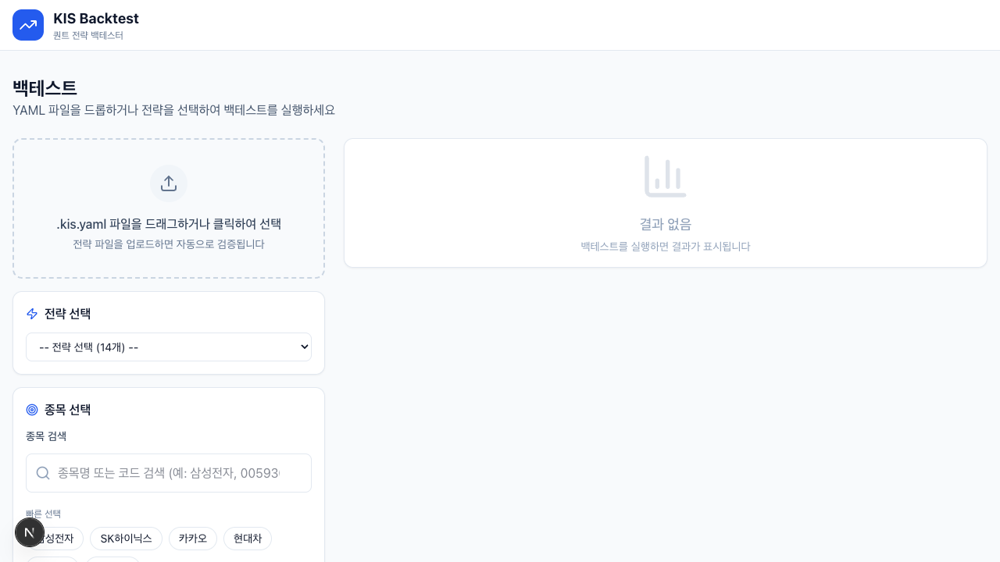

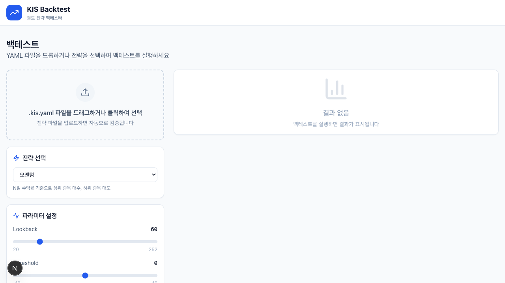

> **종목 검색을 사용하려면 마스터파일 수집이 필요합니다.**
> 우측 상단 ⚙️ 설정 버튼 → 종목 마스터파일 섹션에서 **마스터파일 수집** 버튼을 클릭하여 종목 데이터를 먼저 다운로드하세요.
>
> 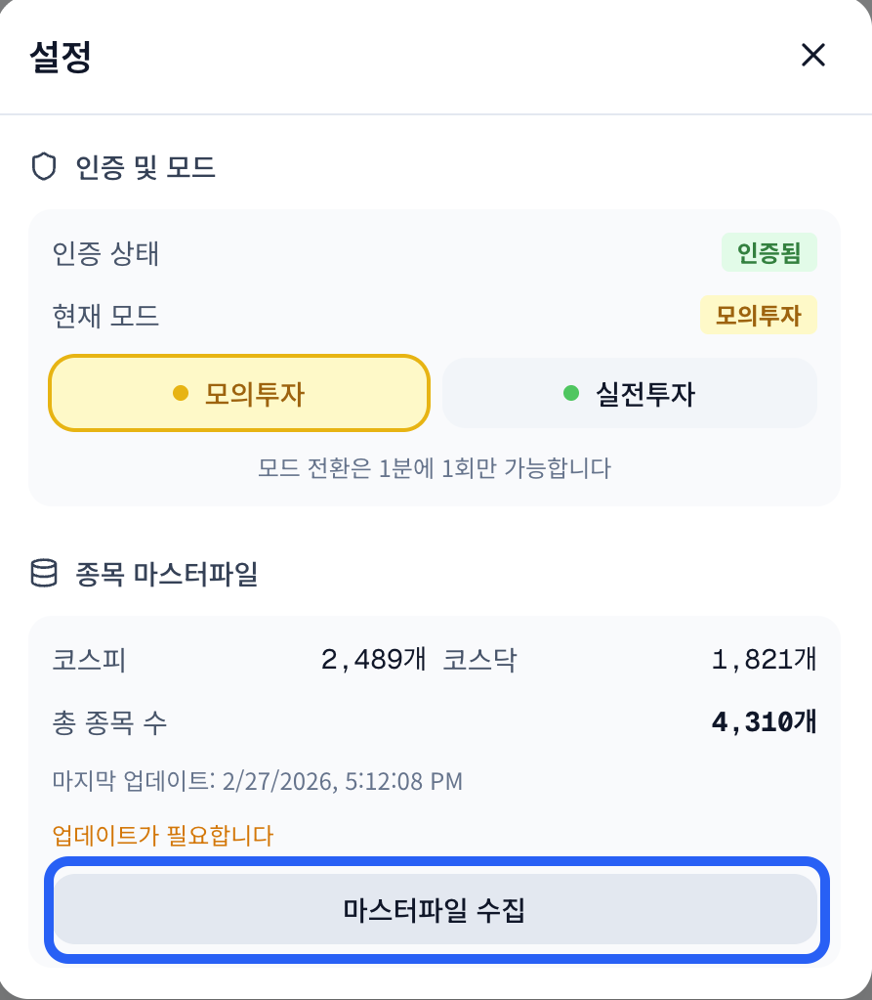

**종목 선택** — 빠른 선택 버튼(삼성전자, SK하이닉스 등) 또는 검색으로 종목을 추가합니다.

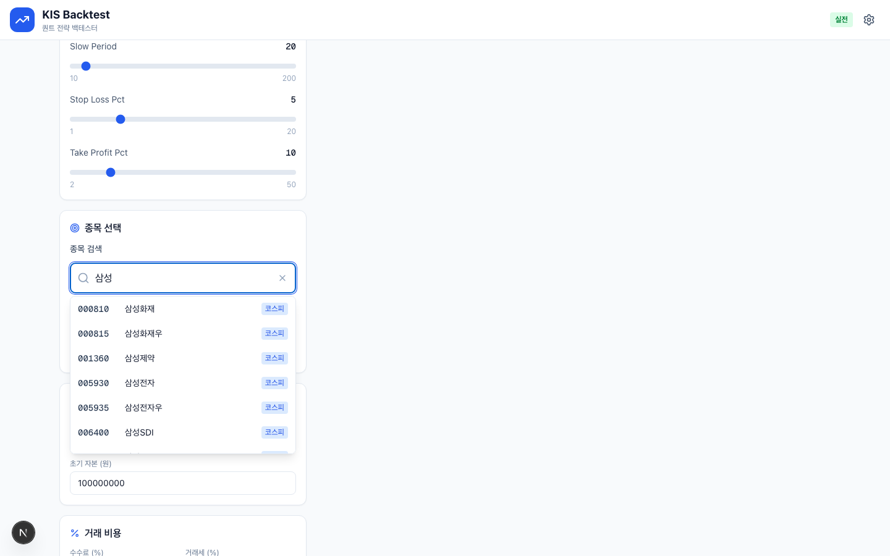

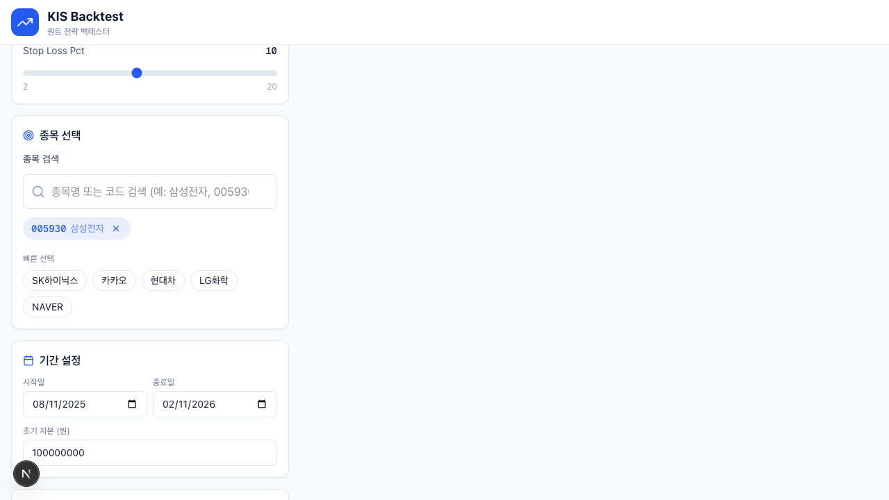

**백테스트 실행** — 결과는 4개 핵심 지표 카드 + 자산 추이 차트 + Drawdown 차트 + 6개 상세 메트릭 그룹으로 구성됩니다.

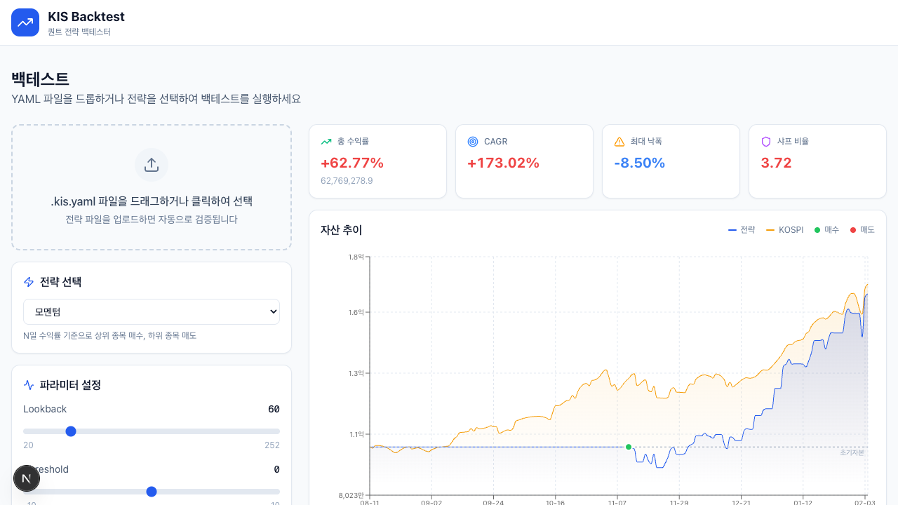

| 지표 | 설명 |
|------|------|
| 총 수익률 | 백테스트 기간 전체 수익률 (%) |
| CAGR | 연환산 수익률 (%) |
| 최대 낙폭 | 고점 대비 최대 하락폭 (%) |
| 샤프 비율 | 위험 대비 수익 효율 (높을수록 좋음) |

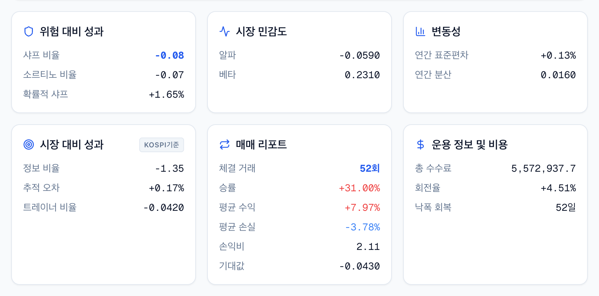

### 결과 지표 해석 시 주의사항

**승률 0%인데 수익이 난다?**

승률(Win Rate)은 **청산된 포지션**만 기준으로 집계됩니다.
백테스트 종료 시점까지 보유 중인 포지션(미청산)의 이익은 총 수익률에는 반영되지만, 승률 계산에서는 빠집니다.

예를 들어, 10번 거래해서 9번 손절하고 1개 종목을 계속 보유해 큰 수익을 냈다면:
- 총 수익률 → 플러스
- 승률 → 10% (청산된 9번 중 0번 승)
- 미실현 이익 → 최종 자산에 포함

> 승률이 낮아도 총 수익률이 높다면 **미실현 이익 비중이 크다는 신호**입니다.
> 실전에서는 매도하기 전까지 이익이 확정되지 않으므로, 매도 조건 설계를 함께 검토하세요.

---

**샤프 비율이 비정상적으로 높다?**

전략에 워밍업(lookback) 파라미터가 있으면 초반 수십 거래일 동안 포트폴리오가 idle 상태(일간 수익률 = 0)입니다.
이 기간이 Sharpe 계산에 포함되면 수익률 표준편차가 인위적으로 낮아져 **Sharpe가 실제보다 크게 표시**될 수 있습니다.

| 워밍업 | Sharpe 보정 기준 |
|--------|-----------------|
| 없음 | 표시값 그대로 |
| 30일 이하 | 소폭 과대계상 가능 |
| 60일 이상 | 실제의 1.5~2배 수준으로 부풀려질 수 있음 |

> Lookback이 긴 전략일수록 Sharpe는 참고용으로만 활용하고,
> **MDD(최대 낙폭)** 와 **수익 곡선의 기울기**를 함께 보는 것을 권장합니다.

---

**CAGR이 너무 높아 보인다?**

CAGR은 백테스트 **시작일~종료일** 전체 기간을 기준으로 연환산합니다.
워밍업 기간 동안 전략이 idle 상태였더라도 그 기간이 포함되어 계산됩니다.
즉, 실제 거래가 절반 기간에만 이뤄졌어도 CAGR 분모는 전체 기간입니다.

> CAGR이 높다면 **실제 첫 거래일이 언제인지** 자산 추이 차트에서 확인하세요.
> 거래가 없는 구간이 길수록 CAGR의 연환산 효과가 과장될 수 있습니다.

---

멀티 종목 백테스트 시 차트의 매수/매도 마커에 호버하면 거래 내역이 툴팁으로 표시됩니다.

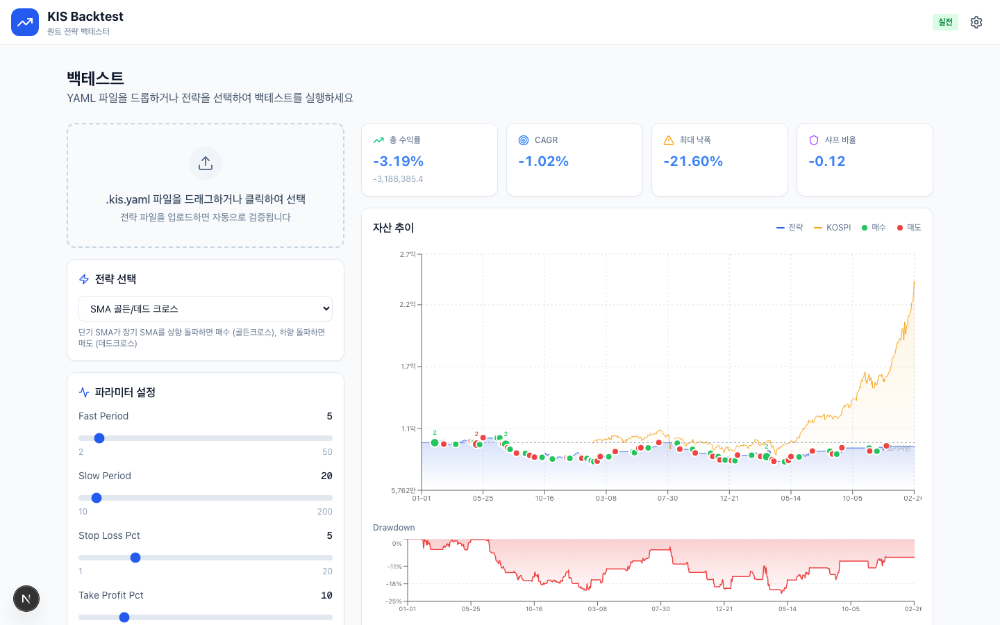

---

## YAML Import 백테스트

Strategy Builder에서 Export한 `.kis.yaml` 파일을 드래그 앤 드롭으로 업로드합니다.

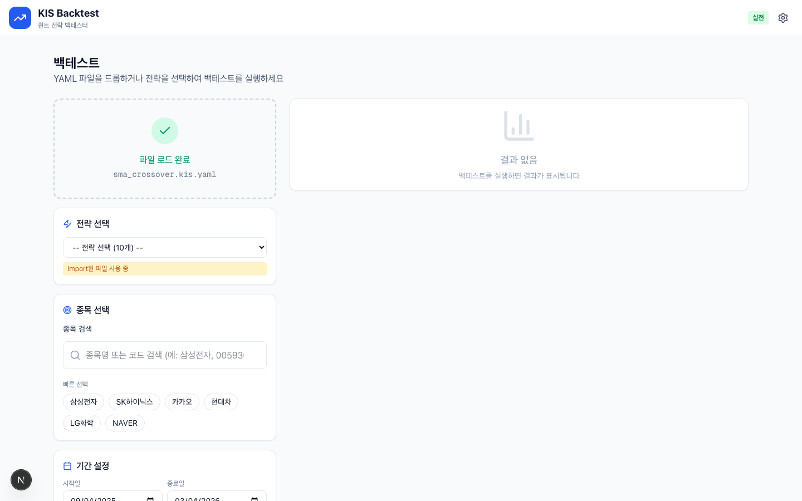

종목 선택 후 백테스트를 실행하면 YAML 기반 전략으로 시뮬레이션됩니다.

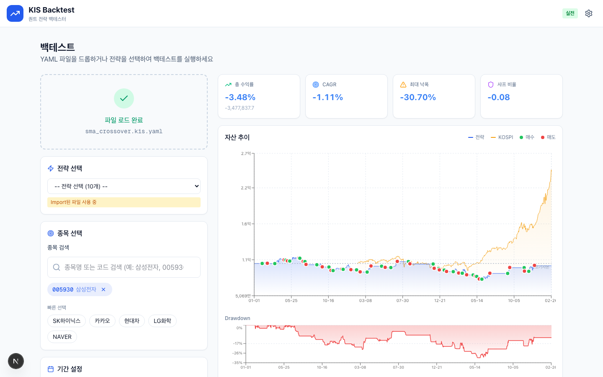

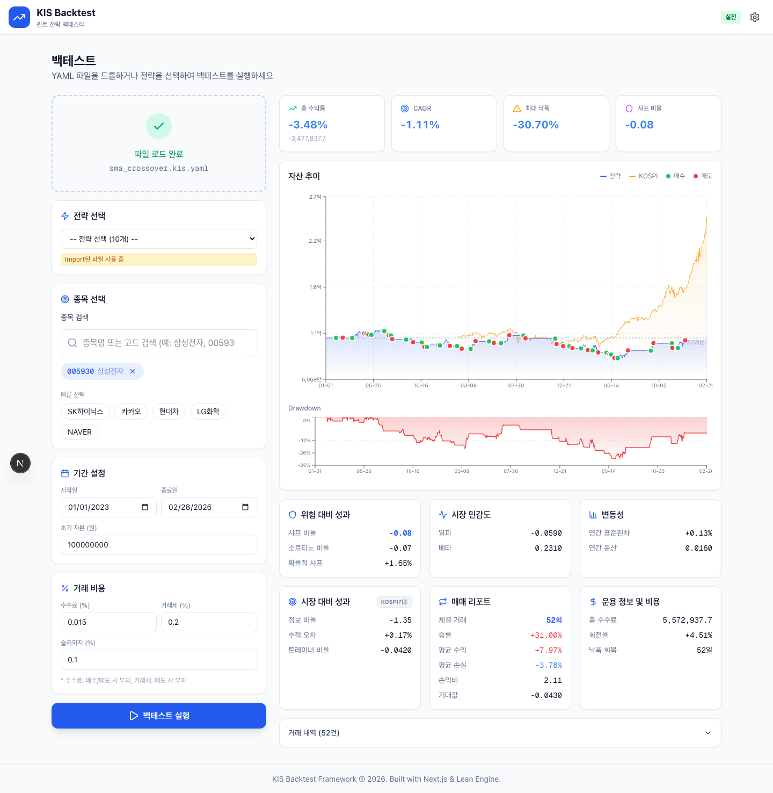

---

## Python 라이브러리 사용법

`kis_backtest`는 독립 라이브러리로, 백엔드 없이 Python 코드에서 직접 사용할 수 있습니다.

### 프리셋 전략 백테스트

```python
from kis_backtest import LeanClient, STRATEGY_REGISTRY
import kis_backtest.strategies.preset  # 10종 전략 자동 등록

# 전략 빌드 (파라미터 오버라이드 가능)
schema = STRATEGY_REGISTRY.build("sma_crossover", fast_period=20, slow_period=50)

# Lean 코드 생성
from kis_backtest import LeanCodeGenerator
generator = LeanCodeGenerator(schema)
code = generator.generate(
    symbols=["005930"],
    start_date="2024-01-01",
    end_date="2024-12-31",
)

# 백테스트 실행 (Docker 필요)
client = LeanClient()
result = await client.run_backtest(code)
```

### RuleBuilder DSL

```python
from kis_backtest import RuleBuilder, SMA, RSI

strategy = (
    RuleBuilder("my_strategy")
    .name("내 전략")
    .category("custom")
    .indicators([SMA(20), SMA(50), RSI(14)])
    .entry(SMA(20).crosses_above(SMA(50)) & RSI(14) < 70)
    .exit(SMA(20).crosses_below(SMA(50)) | RSI(14) > 80)
    .stop_loss(5.0)
    .build()
)
```

### YAML 파일 로드

```python
from kis_backtest import StrategyFileLoader

# 파일에서 로드
schema = StrategyFileLoader.load_as_schema("my_strategy.kis.yaml")

# 파라미터 오버라이드
schema = StrategyFileLoader.load_schema_with_params(
    "my_strategy.kis.yaml",
    param_overrides={"fast_period": 10, "slow_period": 30}
)
```

---

## MCP 서버

Backtester는 MCP(Model Context Protocol) 서버를 제공하여 AI 에이전트에서 직접 백테스트를 호출할 수 있습니다.

### 시작

```bash
bash scripts/start_mcp.sh    # http://127.0.0.1:3846/mcp
```

### MCP 도구

| 도구 | 설명 |
|------|------|
| `list_presets` | 10개 프리셋 전략 목록과 파라미터 정의 |
| `get_preset_yaml` | 프리셋 전략을 `.kis.yaml` 문자열로 반환 |
| `validate_yaml` | YAML 전략 파일 검증 |
| `list_indicators` | 사용 가능한 80개 기술지표 목록 |
| `run_backtest` | YAML 전략 백테스트 실행 (비동기, job_id 반환) |
| `run_preset_backtest` | 프리셋 전략 백테스트 실행 |
| `get_backtest_result` | 결과 조회 (기본: 완료까지 자동 대기, wait=false로 즉시 조회) |
| `retry_backtest` | 실패한 백테스트 재시도 |
| `get_report` | JSON 또는 HTML 리포트 |

### Cursor / Claude Code 연동

`.cursor/mcp.json` 또는 `.mcp.json`에 아래 설정을 추가합니다:

```json
{
  "mcpServers": {
    "kis-backtest": {
      "url": "http://127.0.0.1:3846/mcp"
    }
  }
}
```

---

## 10개 프리셋 전략

| ID | 이름 | 카테고리 | 설명 |
|----|------|----------|------|
| `sma_crossover` | SMA 골든/데드 크로스 | trend | 단기 SMA가 장기 SMA 돌파 시 매매 |
| `momentum` | 모멘텀 | momentum | N일 수익률 기준 매수/매도 |
| `week52_high` | 52주 신고가 돌파 | trend | 52주 최고가 갱신 시 매수 |
| `consecutive_moves` | 연속 상승/하락 | momentum | N일 연속 패턴 감지 |
| `ma_divergence` | 이동평균 이격도 | mean_reversion | MA 대비 이격도 기반 매매 |
| `false_breakout` | 추세 돌파 후 이탈 | trend | 돌파 실패 시 반전 매매 |
| `strong_close` | 강한 종가 | momentum | 고가 대비 종가 위치로 강도 판단 |
| `volatility_breakout` | 변동성 축소 후 확장 | volatility | 변동성 최저 후 돌파 매수 |
| `short_term_reversal` | 단기 반전 | mean_reversion | 과매도 구간 반등 매수 |
| `trend_filter_signal` | 추세 필터 + 시그널 | trend | 추세 방향 확인 후 진입 |

---

## .kis.yaml 포맷

Strategy Builder와 Backtester가 공유하는 전략 정의 포맷입니다.

```yaml
version: "1.0"

metadata:
  name: "SMA 골든/데드 크로스"
  description: "단기 SMA가 장기 SMA 돌파 시 매매"
  author: "KIS"
  tags: [trend, sma, crossover]

strategy:
  id: sma_crossover
  category: trend

  params:
    fast_period:
      default: 20
      min: 2
      max: 100
      type: int
    slow_period:
      default: 50
      min: 2
      max: 200
      type: int

  indicators:
    - id: sma
      alias: sma_fast
      params:
        period: $fast_period
    - id: sma
      alias: sma_slow
      params:
        period: $slow_period

  entry:
    logic: AND
    conditions:
      - indicator: sma_fast
        operator: cross_above
        compare_to: sma_slow

  exit:
    logic: OR
    conditions:
      - indicator: sma_fast
        operator: cross_below
        compare_to: sma_slow

risk:
  stop_loss:
    enabled: true
    percent: 5.0
  take_profit:
    enabled: true
    percent: 10.0
```

### 사용 가능한 연산자

| 연산자 | 의미 |
|--------|------|
| `cross_above` | 상향 돌파 |
| `cross_below` | 하향 돌파 |
| `greater_than` | 초과 |
| `less_than` | 미만 |
| `greater_equal` | 이상 |
| `less_equal` | 이하 |
| `equals` | 같음 |

### 사용 가능한 지표

| 카테고리 | 지표 |
|---------|------|
| 이동평균 | SMA, EMA, WMA, DEMA, TEMA, KAMA, HMA, ALMA, LWMA, TRIMA, T3, ZLEMA, FRAMA, VIDYA |
| 오실레이터 | RSI, Stochastic, MACD, CCI, Williams %R, Momentum, ROC, APO, PPO, Aroon, CMO, AO, CHO, UltOsc, TRIX, TSI, RVI, DPO, KVO |
| 추세 | ADX, ADXR, Ichimoku, SAR, Vortex, CHOP, KST, Coppock, SuperTrend, MassIndex, Schaff, Fisher |
| 거래량 | OBV, AD, ADL, CMF, MFI, Force, VWAP, VWMA, EOM |
| 변동성 | ATR, NATR, Bollinger, Keltner, Donchian, STD, Variance, AccBands, Beta, Alpha |
| 가격 | Close, Open, High, Low |

---

## SSoT 아키텍처

모든 전략 입력은 `StrategySchema`로 통합되어 하나의 파이프라인을 거칩니다.

```
┌─────────────────────────────────────────────────────────┐
│                    입력 (3가지 경로)                      │
├─────────────────────────────────────────────────────────┤
│  Python Preset      YAML File        API Request        │
│  (BaseStrategy)     (.kis.yaml)      (JSON body)        │
└────────┬──────────────┬─────────────────┬───────────────┘
         │              │                 │
         ▼              ▼                 ▼
   from_preset()  from_yaml_file()  from_dict()
         │              │                 │
         └──────────────┼─────────────────┘
                        ▼
            ┌───────────────────────┐
            │    StrategySchema     │  ← Single Source of Truth
            │   (Pydantic Model)    │
            └───────────┬───────────┘
                        │
            ┌───────────┴───────────┐
            ▼                       ▼
     LeanCodeGenerator         API Response
            │                  (JSON + 차트)
            ▼
     Lean Python Code
            │
            ▼
     Docker 백테스트
            │
            ▼
     BacktestResult
```

---

## API 엔드포인트

서버 실행 후 http://localhost:8002/docs 에서 Swagger UI를 확인할 수 있습니다.

### 전략

| Method | Path | 설명 |
|--------|------|------|
| `GET` | `/api/strategies` | 전략 목록 조회 (params 포함) |
| `GET` | `/api/strategies/categories` | 카테고리 목록 |
| `POST` | `/api/strategies/build` | 전략 빌드 (Schema 반환) |

### 백테스트

| Method | Path | 설명 |
|--------|------|------|
| `POST` | `/api/backtest/run` | 프리셋 전략 백테스트 실행 |
| `POST` | `/api/backtest/run-custom` | YAML/커스텀 전략 백테스트 |

### 파일

| Method | Path | 설명 |
|--------|------|------|
| `POST` | `/api/files/validate` | `.kis.yaml` 파일 검증 |
| `GET` | `/api/files/templates` | YAML 템플릿 목록 |

### 종목

| Method | Path | 설명 |
|--------|------|------|
| `GET` | `/api/symbols/search` | 종목 검색 (이름/코드) |
| `GET` | `/api/symbols/{code}` | 종목 상세 정보 |

---

## 디렉토리 구조

```
backtester/
├── kis_backtest/               # Python 라이브러리 (핵심)
│   ├── __init__.py             # Public API exports
│   ├── client.py               # LeanClient (백테스트 실행)
│   ├── core/                   # 도메인 모델 (SSoT)
│   │   ├── schema.py           # StrategySchema, ConditionSchema
│   │   ├── converters.py       # from_preset, from_yaml_file, from_dict
│   │   └── param_resolver.py   # $param_name 치환
│   ├── codegen/                # Lean 코드 생성
│   │   ├── generator.py        # StrategySchema → Python 코드
│   │   └── validator.py        # 지표/조건 검증
│   ├── dsl/                    # RuleBuilder DSL
│   │   ├── builder.py          # RuleBuilder 클래스
│   │   └── helpers.py          # SMA(), RSI(), MACD() 등
│   ├── file/                   # YAML 파일 지원
│   │   ├── loader.py           # .kis.yaml → StrategySchema
│   │   ├── saver.py            # StrategySchema → .kis.yaml
│   │   └── templates/          # 10종 YAML 템플릿
│   ├── strategies/             # 프리셋 전략
│   │   ├── registry.py         # StrategyRegistry (@register)
│   │   ├── base.py             # BaseStrategy 클래스
│   │   └── preset/             # 10개 전략 구현
│   ├── lean/                   # Lean CLI 연동
│   │   ├── executor.py         # Docker 기반 백테스트
│   │   ├── project_manager.py  # 워크스페이스 관리
│   │   └── result_formatter.py # 결과 파싱
│   ├── providers/kis/          # 한국투자증권 API
│   │   ├── auth.py             # 인증/토큰
│   │   ├── data.py             # 시세 데이터
│   │   └── websocket.py        # 실시간 데이터
│   ├── portfolio/              # 포트폴리오 분석
│   │   ├── analyzer.py         # 수익률, 샤프비율, 상관관계
│   │   └── visualizer.py       # 차트 생성
│   └── report/                 # HTML 리포트
│
├── backend/                    # FastAPI 서버
│   ├── main.py                 # 앱 진입점 (port 8002)
│   └── routes/                 # API 엔드포인트
│
├── frontend/                   # Next.js (port 3001)
│   └── src/
│       ├── app/backtest/       # 백테스트 페이지
│       ├── components/
│       │   ├── backtest/       # 결과 차트, 통계 카드
│       │   ├── file/           # FileDropZone
│       │   └── symbols/        # StockInput (검색/선택)
│       └── lib/api/            # Backend API 클라이언트
│
├── kis_mcp/                    # MCP 서버 (port 3846)
│   ├── server.py               # FastMCP 서버
│   └── tools/                  # MCP 도구 (strategy, backtest, report)
│
├── examples/                   # 8개 예제 스크립트
├── scripts/                    # 셋업 스크립트
├── kis_auth.py                 # KIS API 인증 (Strategy Builder와 공유)
└── assets/                     # README 스크린샷
```

---

## 연동: Strategy Builder + Backtester

Strategy Builder와 Backtester는 `.kis.yaml` 파일 포맷으로 연동되어 **설계 → 검증 → 실행**의 완전한 퀀트 워크플로우를 구성합니다.

| 단계 | 시스템 | 내용 |
|------|--------|------|
| 1. 전략 설계 | **Strategy Builder** | 비주얼 UI로 지표/조건/리스크 설정 |
| 2. Export | `.kis.yaml` | 설계한 전략을 YAML 파일로 내보내기 |
| 3. 백테스트 | **Backtester** | 과거 데이터(Lean)로 전략 성과 검증 |
| 4. 분석 | **Backtester** | 수익률, 샤프비율, 최대낙폭, 거래 통계 분석 |
| 5. 최적화 | **Backtester** | Grid/Random Search로 최적 파라미터 탐색 |
| 6. 실전 적용 | **Strategy Builder** | 검증된 전략으로 실시간 시그널 + 모의/실전 주문 |

| 기능 | Strategy Builder | Backtester |
|------|------------------|------------|
| 전략 설계 | 비주얼 빌더 | - |
| 시그널 생성 | 실시간 | - |
| 주문 실행 | 모의/실전 | - |
| 백테스트 | - | Lean (Docker) |
| 포트폴리오 분석 | - | 분석/시각화 |
| 파라미터 최적화 | - | Grid/Random |
| **공유 포맷** | `.kis.yaml` Export | `.kis.yaml` Import |

---

## 문제 해결

### Docker 관련

```bash
docker info                   # Docker Desktop 실행 확인
docker images | grep lean     # Lean 이미지 확인 (첫 실행 시 자동 다운로드)
```

### API 인증

`~/KIS/config/kis_devlp.yaml`을 아래와 같이 설정합니다.

```yaml
# 실전투자
my_app: "여기에 실전투자 앱키 입력"
my_sec: "여기에 실전투자 앱시크릿 입력"

# 모의투자
paper_app: "여기에 모의투자 앱키 입력"
paper_sec: "여기에 모의투자 앱시크릿 입력"

# HTS ID(KIS Developers 고객 ID)
my_htsid: "사용자 HTS ID"

# 계좌번호 앞 8자리
my_acct_stock: "증권계좌 8자리"
my_acct_future: "선물옵션계좌 8자리"
my_paper_stock: "모의투자 증권계좌 8자리"
my_paper_future: "모의투자 선물옵션계좌 8자리"

# 계좌번호 뒤 2자리
my_prod: "01"
```

설정 방법 상세는 [루트 README](../README.md#35-kis_devlpyaml-설정)를 참고하세요.

### API 속도 제한

한국투자증권 API는 초당 호출 횟수 제한이 있습니다.
시스템이 자동으로 캐시된 데이터를 우선 사용하지만,
여러 예제를 연속 실행할 때는 잠시 간격을 두세요.

### 데이터 캐시

```bash
# 캐시 데이터 확인
ls -la .lean-workspace/data/equity/krx/daily/

# 캐시 삭제 후 재다운로드
rm -rf .lean-workspace/data/equity/krx/daily/*.csv
```
