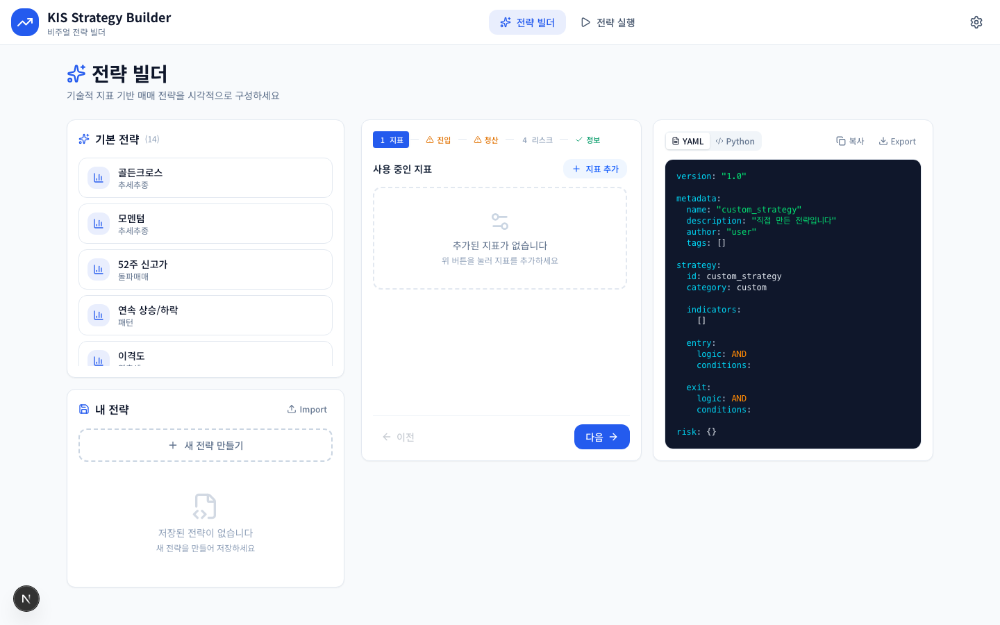
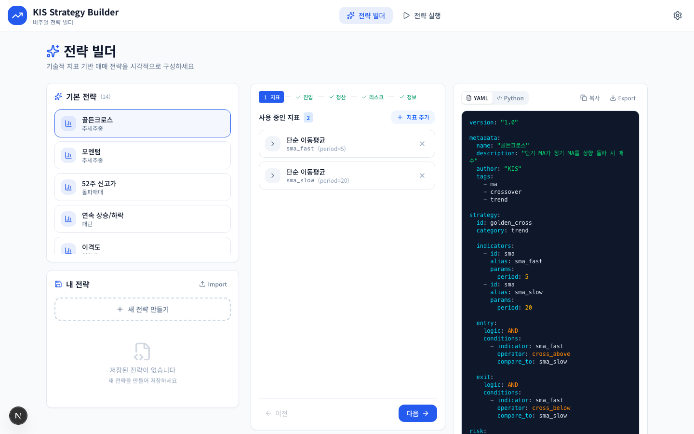
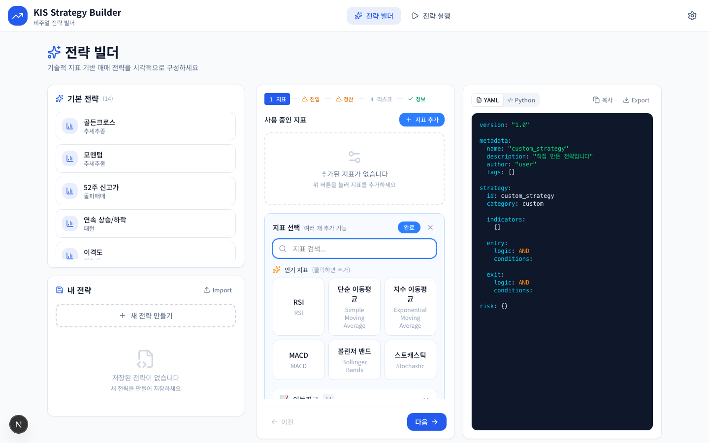
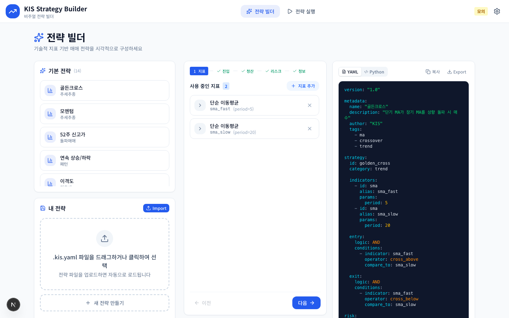
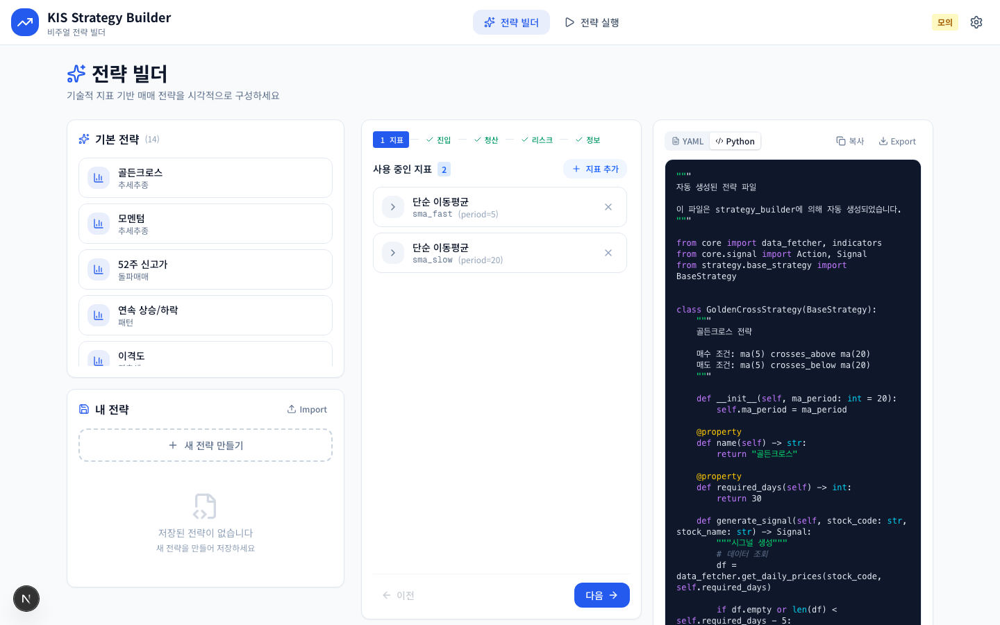
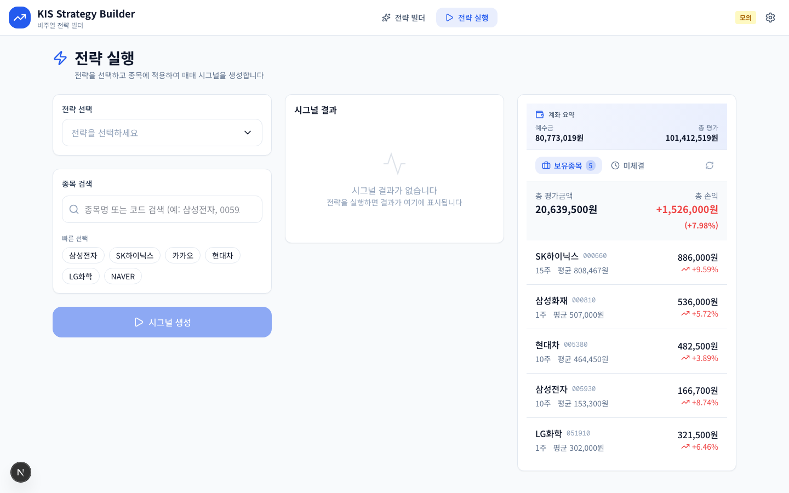
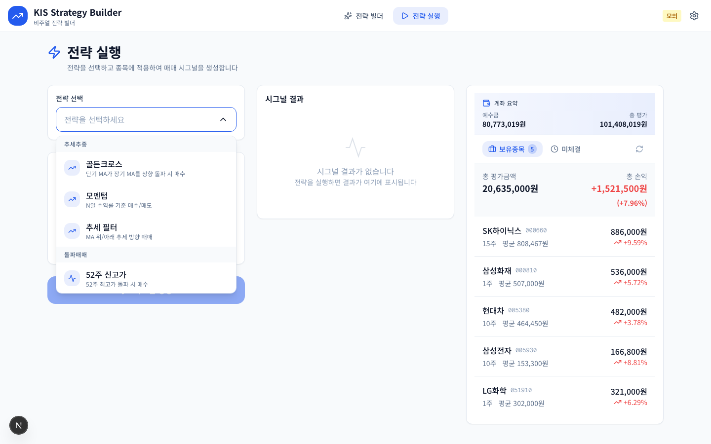
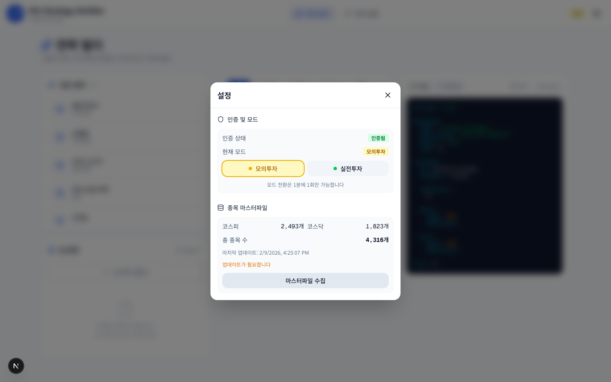

# Strategy Builder — 전략 설계 + 시그널 생성 엔진

한국투자증권 Open API 기반 **비주얼 전략 빌더 + 실시간 주문 실행** 시스템입니다.

코딩 없이 기술적 지표를 조합하여 매매 전략을 설계하고,
설계한 전략을 `.kis.yaml` 파일로 내보내 **Backtester에서 과거 데이터 검증**을 거친 뒤,
검증된 전략을 다시 Strategy Builder에서 **실시간 시그널 생성 및 모의/실전 주문**으로 실행할 수 있습니다.

```
 Strategy Builder    .kis.yaml        Backtester        검증 완료?
┌───────────┐     ┌──────────┐     ┌───────────┐     ┌──────────┐
│ 전략 설계  │────▶│  Export   │────▶│ 백테스트   │────▶│ 결과 확인 │
│ (비주얼)   │     │          │     │ (과거 데이터)│     │ (수익률)  │
└───────────┘     └──────────┘     └───────────┘     └────┬─────┘
      ▲                                                    │
      │              Strategy Builder                      │ 좋으면
      │           ┌──────────────┐                         │
      └───────────│ 실전/모의 주문 │◀────────────────────────┘
                  └──────────────┘
```

---

## 빠른 시작

### 사전 요구사항

- Python 3.11+ / [uv](https://docs.astral.sh/uv/)
- Node.js 18+ / npm
- KIS Open API 키 ([설정 방법](../README.md#35-kis_devlpyaml-설정))

### 서버 실행

```bash
cd strategy_builder
./start.sh
```

백엔드(8000)와 프론트엔드(3000)를 한 번에 시작합니다. `node_modules`가 없으면 `npm install`도 자동 실행됩니다.

브라우저에서 http://localhost:3000 으로 접속하면 전략 빌더 페이지가 표시됩니다.

**수동 실행이 필요할 때**

```bash
# Python 의존성 설치
uv sync

# Backend (터미널 1)
uv run uvicorn backend.main:app --reload --port 8000

# Frontend (터미널 2)
cd frontend
npm install
npm run dev
```

---

## 시스템 구성

```
┌──────────────────────────────────────────────────────────┐
│                    Frontend (Next.js)                     │
│                   http://localhost:3000                   │
│                                                          │
│   /builder                      /execute                 │
│   전략 설계 (빌더)               전략 실행 (시그널+주문)    │
│   YAML/Python Export            10종 전략 선택            │
│   로컬 저장                      종목 검색 + 시그널 생성   │
└────────────────────┬─────────────────────────────────────┘
                     │ Next.js Rewrite (/api/* → :8000)
                     ▼
┌──────────────────────────────────────────────────────────┐
│                    Backend (FastAPI)                      │
│                   http://localhost:8000                   │
│                                                          │
│   /api/strategies        10종 전략 (StrategyRegistry)    │
│   /api/strategies/execute    시그널 생성 (4가지 경로)     │
│   /api/orders/execute        주문 실행                   │
│   /api/auth/*                KIS API 인증                │
│   /api/market/*              시세/호가 조회              │
└────────────────────┬─────────────────────────────────────┘
                     │
                     ▼
          ┌─────────────────────┐
          │   KIS Open API      │
          │  (한국투자증권)       │
          │  모의투자 / 실전투자  │
          └─────────────────────┘
```

---

## 주요 기능

| 기능 | 설명 |
|------|------|
| 비주얼 빌더 (`/builder`) | 드래그 앤 드롭으로 지표/조건/리스크 설계 |
| 80개 기술지표 | RSI, MACD, 볼린저밴드, VWAP, 이치모쿠 등 |
| 57개 캔들스틱 패턴 | 도지, 잉걸핑, 해머 등 (Lean 미지원 9개 제외) |
| YAML Export/Import | `.kis.yaml` ↔ 빌더 양방향 변환 |
| Python 미리보기 | 빌더 상태 → 실행 가능한 Python 코드 실시간 생성 |
| 시그널 생성 (`/execute`) | 종목 입력 → BUY/SELL/HOLD + 강도(0~1) |
| 주문 실행 | 모의/실전 주문 (KIS Open API) |

---

## 전략 빌더

앱에 접속하면 전략 빌더 페이지가 표시됩니다.
좌측에 기본 전략 10종 + 내 전략 목록, 중앙에 5단계 빌더(지표→진입→청산→리스크→정보), 우측에 YAML/Python 미리보기가 배치됩니다.



**Step 1. 프리셋 전략 불러오기** — 좌측 목록에서 기본 전략을 클릭하면 지표, 조건, 리스크가 자동으로 채워집니다.



**Step 2. 지표 추가** — `+ 지표 추가` 버튼으로 80개 기술지표 중 원하는 것을 선택합니다.



**Step 3. 진입/청산 조건 설정** — AND/OR 로직으로 조합합니다.
예: `SMA(5) cross_above SMA(20)`, `RSI > 70`

**Step 4. 리스크 관리** — 손절/익절/트레일링 스톱을 퍼센트 단위로 설정합니다.

**Step 5. 저장** — 전략 이름, 설명, 태그를 입력하고 로컬스토리지에 저장합니다.


---

## YAML/Python Export

빌더 우측에 YAML과 Python 코드가 실시간으로 생성됩니다.





| 버튼 | 동작 |
|------|------|
| **복사** | 클립보드에 YAML 또는 Python 코드 복사 |
| **Export** | `.kis.yaml` 파일로 다운로드 → **Backtester에서 백테스트 가능** |
| **Import** | 기존 YAML 파일을 드래그 앤 드롭으로 불러오기 |

---

## 전략 실행

상단 네비게이션에서 **전략 실행**을 클릭하면 실행 페이지로 이동합니다.



1. **전략 선택** — 10개 기본 전략이 카테고리별로 분류. 빌더에서 만든 로컬 전략도 선택 가능.



> **종목 검색을 사용하려면 마스터파일 수집이 필요합니다.**
> 우측 상단 ⚙️ 설정 버튼 → 종목 마스터파일 섹션에서 **마스터파일 수집** 버튼을 클릭하여 종목 데이터를 먼저 다운로드하세요.
>
> 

2. **종목 선택** — 코드 직접 입력 또는 빠른 선택 버튼(삼성전자, SK하이닉스 등)

3. **시그널 생성** — BUY/SELL/HOLD 시그널 확인 후 주문 실행 가능 (KIS API 인증 필요)

---

## 인증 및 설정

우측 상단 톱니바퀴 → 설정 모달에서 인증 상태, 모의/실전 전환, 종목 마스터파일을 관리합니다.



---

## 10개 프리셋 전략

| ID | 이름 | 카테고리 | 설명 |
|----|------|---------|------|
| `golden_cross` | 골든크로스 | 추세추종 | 단기 MA가 장기 MA를 상향 돌파 시 매수 |
| `momentum` | 모멘텀 | 추세추종 | N일 수익률 기준 매수/매도 |
| `trend_filter` | 추세 필터 | 추세추종 | MA 위/아래 추세 방향 매매 |
| `week52_high` | 52주 신고가 | 돌파매매 | 52주 최고가 돌파 시 매수 |
| `consecutive` | 연속 상승/하락 | 추세추종 | N일 연속 상승 시 매수 |
| `disparity` | 이격도 | 역추세 | MA 대비 이격 기준 매매 |
| `breakout_fail` | 돌파 실패 | 손절 | 전고점 돌파 실패 시 매도 |
| `strong_close` | 강한 종가 | 모멘텀 | 고가 대비 종가 위치로 매수 |
| `volatility` | 변동성 확장 | 돌파매매 | 변동성 최저에서 돌파 시 매수 |
| `mean_reversion` | 평균회귀 | 역추세 | N일 평균 대비 이탈 시 매매 |

---

## .kis.yaml 포맷

Strategy Builder와 Backtester가 공유하는 전략 정의 포맷입니다.
Strategy Builder에서 `.kis.yaml`로 내보낸 전략을 Backtester에서 불러와 백테스트를 수행하고,
검증이 완료된 전략을 다시 Strategy Builder에서 Import하여 실전 주문에 활용합니다.

```yaml
version: "1.0"

metadata:
  name: "골든크로스"
  description: "단기 MA가 장기 MA를 상향 돌파 시 매수"
  author: "KIS"
  tags: [ma, crossover, trend]

strategy:
  id: golden_cross
  category: trend

  indicators:
    - id: sma
      alias: sma_fast
      params:
        period: 5
    - id: sma
      alias: sma_slow
      params:
        period: 20

  entry:
    logic: AND
    conditions:
      - indicator: sma_fast
        operator: cross_above
        compare_to: sma_slow

  exit:
    logic: AND
    conditions:
      - indicator: sma_fast
        operator: cross_below
        compare_to: sma_slow

risk:
  stop_loss:
    enabled: true
    percent: 5.0
```

### 사용 가능한 연산자

| 연산자 | 의미 |
|--------|------|
| `cross_above` | 상향 돌파 |
| `cross_below` | 하향 돌파 |
| `greater_than` | 초과 |
| `less_than` | 미만 |
| `greater_equal` | 이상 |
| `less_equal` | 이하 |
| `equals` | 같음 |

---

## API 엔드포인트

### 인증

| Method | Path | 설명 |
|--------|------|------|
| `GET` | `/api/auth/status` | 인증 상태 확인 (모드, 인증 여부) |
| `POST` | `/api/auth/login` | 로그인 (mode: `vps` 모의투자 / `prod` 실전투자) |

### 전략

| Method | Path | 설명 |
|--------|------|------|
| `GET` | `/api/strategies` | 전략 목록 (10종, builder_state 포함) |
| `GET` | `/api/strategies/indicators` | 사용 가능한 지표 목록 |
| `POST` | `/api/strategies/execute` | 전략 실행 → 시그널 생성 |
| `POST` | `/api/strategies/preview` | Python 코드 미리보기 |
| `GET` | `/api/strategies/custom` | 커스텀 전략 목록 |

### 계좌 / 주문

| Method | Path | 설명 |
|--------|------|------|
| `GET` | `/api/account/holdings` | 보유 종목 |
| `GET` | `/api/account/balance` | 예수금 / 평가금액 |
| `POST` | `/api/orders/execute` | 주문 실행 (매수/매도) |

### 시장 / 파일

| Method | Path | 설명 |
|--------|------|------|
| `GET` | `/api/market/orderbook/:code` | 호가 조회 |
| `WS` | `/api/market/ws/:code` | 실시간 호가 (WebSocket) |
| `GET` | `/api/files/templates` | YAML 전략 템플릿 목록 |
| `POST` | `/api/files/import` | YAML 파일 Import |
| `POST` | `/api/files/export` | 전략 Export |

---

## 디렉토리 구조

```
strategy_builder/
├── assets/                     # 유저 플로우 스크린샷
│
├── backend/                    # FastAPI 서버 (port 8000)
│   ├── main.py                 # 앱 진입점
│   └── routers/
│       ├── auth.py             # 인증 API
│       ├── account.py          # 계좌 API (잔고/보유종목)
│       ├── strategy.py         # 전략 API (목록/실행/미리보기)
│       ├── orders.py           # 주문 API (매수/매도)
│       ├── market.py           # 시장 API (호가/웹소켓)
│       ├── files.py            # 파일 API (YAML 템플릿)
│       └── symbols.py          # 종목 검색
│
├── strategy_core/              # 전략 엔진 (SSoT)
│   ├── registry.py             # StrategyRegistry (@register 데코레이터)
│   ├── executor.py             # 4가지 실행 경로 통합
│   ├── dsl/
│   │   ├── converter.py        # BuilderState → DSL 변환
│   │   ├── parser.py           # DSL → AST 파싱
│   │   └── codegen.py          # AST → Python 코드 생성
│   └── preset/                 # 10개 프리셋 전략 정의
│
├── core/                       # 핵심 모듈
│   ├── signal.py               # Signal, Action 정의
│   ├── indicators.py           # 기술적 지표 계산 (80종)
│   ├── data_fetcher.py         # KIS API 데이터 조회
│   ├── order_executor.py       # 주문 실행
│   ├── position_manager.py     # 포지션 관리
│   └── websocket_manager.py    # 실시간 데이터
│
├── strategy/                   # 전략 구현체
│   ├── base_strategy.py        # BaseStrategy 클래스
│   └── strategy_01 ~ 10.py    # 10개 전략 파일
│
├── frontend/                   # Next.js 프론트엔드 (port 3000)
│   └── src/
│       ├── app/
│       │   ├── builder/        # 전략 빌더 페이지
│       │   └── execute/        # 전략 실행 페이지
│       ├── components/
│       │   ├── builder/        # 빌더 UI (지표, 조건, 리스크, 미리보기)
│       │   ├── execute/        # 실행 UI (전략 선택, 시그널, 주문)
│       │   ├── file/           # FileDropZone, ExportButton
│       │   └── layout/         # Navigation, Settings
│       ├── hooks/              # useStrategyBuilder, useAuth, useOrder ...
│       ├── lib/
│       │   ├── api/            # Backend API 클라이언트
│       │   └── builder/        # 80개 지표 정의, YAML 변환
│       └── types/              # TypeScript 타입 정의
│
├── examples/                   # 실행 예제 (README.md 참조)
└── kis_auth.py                 # KIS API 인증 모듈
```

---

## 연동: Strategy Builder + Backtester

Strategy Builder와 Backtester는 `.kis.yaml` 파일 포맷으로 연동되어 **설계 → 검증 → 실행**의 완전한 퀀트 워크플로우를 구성합니다.

| 단계 | 시스템 | 내용 |
|------|--------|------|
| 1. 전략 설계 | **Strategy Builder** | 비주얼 UI로 지표/조건/리스크 설정 |
| 2. Export | `.kis.yaml` | 설계한 전략을 YAML 파일로 내보내기 |
| 3. 백테스트 | **Backtester** | 과거 데이터(Lean)로 전략 성과 검증 |
| 4. 분석 | **Backtester** | 수익률, 샤프비율, 최대낙폭 분석 |
| 5. 최적화 | **Backtester** | Grid/Random Search로 최적 파라미터 탐색 |
| 6. 실전 적용 | **Strategy Builder** | 검증된 전략으로 실시간 시그널 + 모의/실전 주문 |

```
┌──────────────────────────────────────────────────────────────────┐
│                    전체 퀀트 워크플로우                             │
│                                                                  │
│   Builder ──Export──▶ .kis.yaml ──Import──▶ Backtester            │
│      ▲                                         │                 │
│      │                                    결과 분석               │
│      │                                    (수익률, 샤프비율)       │
│      │                                         │                 │
│      │         성과 좋으면                       │                 │
│   Builder ◀────────────────────────────────────┘                  │
│   (모의투자로 먼저 검증 → 실전투자)                                 │
└──────────────────────────────────────────────────────────────────┘
```

| 기능 | Strategy Builder | Backtester |
|------|------------------|------------|
| 전략 설계 | 비주얼 빌더 | - |
| 시그널 생성 | 실시간 | - |
| 주문 실행 | 모의/실전 | - |
| 백테스트 | - | Lean (Docker) |
| 포트폴리오 분석 | - | 분석/시각화 |
| 파라미터 최적화 | - | Grid/Random |
| **공유 포맷** | `.kis.yaml` Export | `.kis.yaml` Import |
